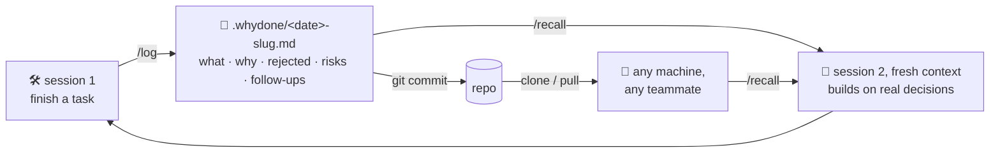

# 📓 whydone — Done. And why.

<p align="center">
  <picture>
    <source media="(prefers-color-scheme: dark)" srcset="https://raw.githubusercontent.com/chevgan/whydone/main/docs/assets/banner-dark.svg">
    
  </picture>
</p>

<p align="center">
  <strong>Stop making your coding agent rediscover yesterday's decisions.</strong><br>
  A repo-committed decision log for AI coding agents.<br>
  ADR × worklog · survives <code>git clone</code> · reviewable in PRs
</p>

<p align="center">
  <a href="https://github.com/chevgan/whydone/actions/workflows/ci.yml"></a>
  <a href="https://nodejs.org/">= 20.19"></a>
  <a href="https://www.npmjs.com/package/whydone"></a>
  <a href="LICENSE"></a>
</p>

<p align="center">
  <a href="#quickstart"><strong>Quickstart</strong></a> ·
  <a href="#see-it-in-30-seconds">Demo</a> ·
  <a href="#why-whydone">Why whydone</a> ·
  <a href="#technical-reference">Technical reference</a> ·
  <a href="SCHEMA.md">Schema</a>
</p>

## Your code survives the session. The reasoning usually doesn't.

An AI coding agent finishes a task, the tests pass, and the code is committed. Then the session ends.

The next session sees the code — but not the decisions behind it. It re-reads, re-guesses, re-litigates rejected alternatives, and steps on gotchas you already found.

**whydone gives the project itself a memory.**

After a task, `/log` writes one Markdown entry containing what changed, why, what was rejected, what's still risky, and what needs follow-up. Before related work, `/recall` loads only the relevant entries back into context.

The journal lives in `.whydone/` beside your code:

- **Plain Markdown** — readable by humans, agents, editors, and CI.
- **Versioned with git** — the reasoning survives a fresh clone.
- **Reviewable in PRs** — your team can approve, correct, or reject it.
- **No service to trust** — no backend, database, account, or embeddings.

## See it in 30 seconds

```text
── session 1 ─────────────────────────────────────────────
you:    refactor the auth middleware to use sessions
claude: ...done. Tests green.
you:    /log
claude: wrote .whydone/20260716-auth-session-middleware.md
        why sessions won over JWT · CSRF gotcha · one follow-up

── session 2 · days later · fresh context ────────────────
you:    /recall auth middleware
claude: loaded 2 relevant entries.
        JWT was rejected for revocation cost.
        Open follow-up: verify CSRF token rotation.
you:    add logout-everywhere
claude: builds on the decision instead of reopening it
```

In `ask` and `auto` modes, whydone can offer or write the entry when substantive work ends — you do not have to remember `/log` every time. `/recall` can also run when Claude notices it is about to touch code with recorded history.

## Quickstart

Install the Claude Code plugin once. It works in every repo you open, in any language, with no npm project required.

Run inside a Claude Code terminal session:

```text
/plugin marketplace add chevgan/whydone
/plugin install whydone@whydone
```

Start a **new Claude Code session**, then finish a small task and run:

```text
/whydone:log
```

The first run offers to create `.whydone/` and asks two explicit questions:

1. Should the journal be **committed** or **local**?
2. Should entries be written in **ask**, **auto**, or **manual** mode?

Open another session and try:

```text
/whydone:recall <topic>
```


**Then keep working.** In `ask` mode (the recommended default) whydone offers the next entry by itself when substantive work ends.

<details>
<summary><strong>Installing from the desktop app — or anywhere without slash commands</strong></summary>

The `/plugin` dialog is terminal-only. Run the same install once from any regular shell — the result is identical and per-machine:

```bash
claude plugin marketplace add chevgan/whydone
claude plugin install whydone@whydone
```

Then start a new session. `claude plugin list` shows what's installed.

</details>

### Alternative: npm devDependency (Node projects, teams, CI)

```bash
npm i -D whydone
npx whydone init
```

The npm channel pins the whydone version in your lock-file, commits the skills into `.claude/skills/` (plain `/log` and `/recall` names, no namespace), and gives CI `npx whydone validate`. `init` runs a three-question wizard:

```
whydone — Done. And why.

◆ Journal mode — how entries get written:
  ● ask (recommended) — after substantive work, Claude drafts an entry and asks before writing
  ○ auto — Claude writes entries itself; you review them in git diff
  ○ manual — only when you run /log

◆ Journal storage — where entries live:
  ● committed (recommended) — ordinary repo files, teammates and CI see the journal
  ○ local — hidden from git via .git/info/exclude, this machine only

◆ Install a Stop hook into .claude/settings.local.json?
  It runs `whydone hook stop` when Claude finishes a turn and nudges per your mode.
```

Then it copies the skills into your project's `.claude/skills/`, scaffolds `.whydone/` with a seed `INDEX.md`, writes your mode to `.whydone/config.json`, adds a small marker block to your CLAUDE.md, and — with your consent — installs the Stop hook.

Non-interactive setup: `npx whydone init --yes` (ask mode + hook), or `npx whydone init --mode auto`. In CI / non-TTY, a bare `init` asks nothing, installs no hook, and never overwrites a committed mode.

Whichever channel runs it, the skills resolve the CLI through a fixed offline chain — the plugin's vendored `bin/whydone.mjs` first, then `npx --no-install whydone` from `node_modules` — never a network fetch mid-session.

## Why whydone

| Every new session, without whydone | With whydone |
|---|---|
| Claude re-reads the code and *guesses* why it looks that way | `/recall` loads the recorded decision in seconds |
| Confidently re-litigates choices you already made | "JWT was rejected on 07-16 — revocation cost. Building on sessions." |
| Re-steps on rakes you already found | Gotchas resurface *before* the code is touched |
| Open follow-ups die with the context window | Unchecked `- [ ]` items come back until they're done |
| Your teammates' Claude knows nothing about any of it | The whole history arrives with `git clone` |



**This is not a release changelog.** No Keep a Changelog, no changesets, no "Added/Fixed/Removed" for your users. Entries are closer to [ADRs](https://adr.github.io/) crossed with a dev worklog — decisions and gotchas, written by the AI that made them, for the AI that comes next.

**This is not Claude Code's built-in memory either.** Native auto-memory is a private, machine-local scratchpad: it helps the one Claude on your machine, is not committed, cannot be code-reviewed, and does not survive a fresh clone — your teammates and your CI never see it. whydone is the opposite by design: entries are ordinary files in the repo. They travel with `git clone`, show up in PR diffs where humans can veto them, and are readable by any agent or tool. Use both: native memory for personal working notes, whydone for the decisions the project itself must not forget.

## Journal modes

The mode lives in `.whydone/config.json` and controls two things: whether `/log` asks before writing, and what the Stop hook does when it detects unlogged work.

| Mode | `/log` confirm | Stop hook |
|---|---|---|
| `manual` | asks one confirm question | silent, always |
| `ask` (recommended) | asks one confirm question | on unlogged work, nudges Claude to draft the entry and **ask** before writing |
| `auto` | writes silently — nothing in the chat at all | on every real change, nudges Claude to write the entry or update the one this session already wrote |

**How the trigger works.** Plugin installs ship the Stop hook with the plugin itself — active in every project, no per-project step. On the npm channel, `init` installs it into `.claude/settings.local.json` (or `~/.claude/settings.json` with `--global`). Either way, when Claude finishes a turn, the hook checks for a work signal — commits or dirty files since the last journal entry — and tells Claude to invoke `/log`. How often it fires depends on what a nudge costs you. In `ask` a nudge is a question, so it comes once per commit-bounded chunk of work: after one, the hook stays quiet until it has produced an entry **and** new commits have landed since — uncommitted churn never re-asks, and a declined nudge stays declined for the rest of the session. In `auto` a nudge costs you nothing (no question, no chat output), so it fires whenever the working tree actually changed, and the session's entry is rewritten in place instead of freezing at whatever the first turn contained. In both modes an unchanged repo state never nudges twice. It is silent in manual mode, silent without git, silent on a fresh journal with zero entries (your repo history is never retroactively "unlogged"), silent right after a normal `/log`-then-commit cycle, and silent on every internal error — a hook failure can never block your turn. On the npm channel the hook command runs the generated launcher at `.claude/whydone-hook.cjs` (installed as an absolute `node "…/whydone-hook.cjs"` command) — a one-screen script, per-machine, harmless if committed, fine to gitignore. On the plugin channel there is no launcher: the hook ships inside the plugin and runs its vendored CLI directly (`node "${CLAUDE_PLUGIN_ROOT}/bin/whydone.mjs" hook stop`).

**Auto mode is fire-and-forget.** Nothing is printed — no preview, no question, no report. The journal never speaks in the chat; only a failed index rebuild or a validation error does. One session leaves one entry: while that entry is still uncommitted, later turns rewrite it whole, so it ends up describing the session instead of its first ten minutes. Once you commit it, it is history — a later change becomes a new entry, with `supersedes:` if it overturns the old one. And auto never asks: nothing new to log means nothing is written, a size-detected minimal entry is written full instead, and a truncated file list or a missing git repo is a fact the entry carries rather than a question for you. Review it in `git diff` (or open the file for local-storage journals); delete it to reject.

**Switching modes:** `npx whydone init --mode auto` (or re-run `npx whydone init` and pick in the wizard). The mode is **committed team policy** — teammates inherit it on pull, the way `.changeset/config.json` or `lefthook.yml` work.

**Disabling:** `--no-hook` at init skips the hook entirely; `npx whydone uninstall` removes it; deleting `.whydone/config.json` (or any broken/missing config) degrades everything to manual. Claude Code's `disableAllHooks` also neutralizes it — ask/auto then simply behave like manual until you run `/log` yourself.

## Private mode: a local-only journal

Some people don't advertise that they work with an AI — company policy, client optics, or simple preference. For them the default journal is hostile: a committed `.whydone/` announces it in every PR. Private mode keeps the full journal loop — `/log`, `/recall`, ranking, the Stop hook — while the journal never touches git:

```bash
npx whydone init --local        # fresh setup on the npm channel
whydone hide                    # or: make an existing not-yet-committed journal private
whydone publish                 # reverse it — the whole history becomes the team journal
```

On the plugin channel there is no `npx` to type: answer **local** when `/whydone:log` first offers to scaffold the journal, or just ask Claude in a session to run `whydone hide` / `whydone publish` — the skills know how to reach the plugin's own CLI.

How it stays invisible: `.whydone/` — and CLAUDE.md whenever it is not yet tracked by git (including one you created yourself; `publish` un-hides both) — goes into **`.git/info/exclude`** — git's *local* ignore file that itself never gets committed. Unlike a `.gitignore` line, which would reveal the journal's name in the repo, `info/exclude` leaves zero trace in any diff, and the journal disappears from `git status` entirely. `storage: local` is recorded in `.whydone/config.json`, and the `/log` skill keeps applying the full no-secrets rules — every entry is written as if it might be published one day, because it might: `whydone publish` + `git add` is the entire migration.

Honest limits, in order of importance:

- **No backup.** A local journal exists only in that folder on that machine. Delete it — it's gone. Concretely: **`git clean -xdf` deletes it** (excluded files are exactly what `-x` targets) and `git stash --all` carries it away into the stash; plain `git clean -fd` and `git stash -u` are safe.
- **A tracked CLAUDE.md can't be hidden.** The marker block whydone adds to an already-committed CLAUDE.md shows up in `git status` (excludes only work for untracked files). Keep it uncommitted, or `git restore CLAUDE.md` — the journal itself stays invisible either way.
- **Already-committed journals can't be un-published by hiding.** `whydone hide` refuses if `.whydone/` is tracked: entries that reached git history stay in git history; untracking is a deliberate git operation it won't do for you.
- **whydone hides the journal, not the AI.** Commit style, velocity, and the npm channel's own traces (package.json devDependency, `.claude/skills/`) are outside its jurisdiction — full tracelessness is the plugin channel + `init --journal-only --local`.

## Working in a team

**Plugin teams:** the journal (`.whydone/`) and the CLAUDE.md marker block are committed and travel with the repo; each teammate installs the plugin once on their machine and the whole decision history answers immediately after `git clone` — no per-project setup at all.

**npm teams** additionally commit the skills and pin the version. What's committed: `.whydone/` (entries + config.json — including the journal mode, which is team policy), `.claude/skills/` (the skills), `.claude/whydone.lock.json`, and the CLAUDE.md marker block. What's not: `.claude/settings.local.json` (the Stop hook) and `.whydone/.cache/` (hook state) — both per-machine.

A teammate after `git clone` (npm channel):

1. `npm i` — whydone is already a devDependency.
2. `npx whydone init` — idempotent: skills/config/journal already exist and are left untouched (the committed mode is never overwritten by a re-run). In a terminal the wizard opens preselecting the committed mode and asks the one hook-consent question — that consent is what installs the local Stop hook. In CI / non-TTY, init changes nothing and installs no hook (pipelines don't need one).
3. New Claude Code session → `/recall <topic>` — the whole team's decision history answers.

## Technical reference

Everything deterministic under the hood: the entry contract, the CLI, the ranking formula, and the two delivery channels.

### What an entry looks like

Markdown + YAML frontmatter, one file per entry at `.whydone/<YYYYMMDD-slug>.md`:

```markdown
---
schema: 1                        # format version, always 1 for now
id: 20260716-auth-session-middleware   # = filename stem, canonical identity
date: "2026-07-16"               # quoted, or YAML eats it as a Date object
slug: auth-session-middleware
task: "Move auth middleware from JWT to cookie sessions"
status: done                     # done | wip | blocked
tags: [auth, middleware]
files: [src/middleware/auth.ts, src/lib/session.ts]
---

## What changed
- Replaced JWT verification with server-side cookie sessions.

## Why / decisions
- Revocation: killing a session must be instant; JWT blocklists
  reintroduce the state JWT was supposed to avoid.

## Alternatives rejected
- Short-lived JWT + refresh rotation — 2x the moving parts for
  the same guarantee.

## Gotchas / risks
- Session cookie is SameSite=Lax; the /webhook endpoint bypasses
  it on purpose.

## Verify-later / follow-ups
- [ ] Confirm CSRF token rotation under concurrent tabs.
```

Five canonical body sections; empty ones are omitted, not padded. The exact heading strings matter — tooling matches them verbatim. Full contract in [SCHEMA.md](SCHEMA.md).

### CLI reference

The skills do the AI work; the CLI does everything deterministic. All commands accept `--quiet` and `--no-color`; most accept `--dry-run`.

| Command | What it does |
|---|---|
| `npx whydone init` | Interactive wizard: copy skills into `.claude/skills/`, scaffold `.whydone/`, write `config.json`, patch CLAUDE.md, install the Stop hook (with consent). Idempotent. See flags below. |
| `npx whydone index` | Rebuild `INDEX.md` + `manifest.json` from entries. CI-friendly. `--json` for a machine summary. |
| `npx whydone validate` | Strict schema check on every entry. Exits non-zero on errors — put it in CI. `--json` for a report. |
| `npx whydone recall` | Rank entries against a query. Read-only, no LLM. See flags below. |
| `npx whydone update` | Re-copy skills from the installed package version and refresh the hook launcher. Force-overwrites skills (see FAQ); never adds a hook that init didn't. |
| `npx whydone hide` | Make the journal local-only: hide `.whydone/` via `.git/info/exclude`, record `storage: local`. Refuses if the journal is already tracked by git. |
| `npx whydone publish` | Reverse of `hide`: unhide the journal, restore the CLAUDE.md marker, record `storage: committed`, print the `git add` to run. |
| `npx whydone uninstall` | Remove installed skills, the CLAUDE.md block, and the Stop hook + launcher. `--global` targets the `~/.claude/` install instead. `--purge` also deletes `.whydone/` (and its exclude entries). |
| `npx whydone hook stop` | Internal — invoked by the Stop hook. Reads the hook payload on stdin, checks for unlogged work, nudges or stays silent. Always exits 0. |

`index`, `validate`, and `recall` take an optional path positional (default `.whydone`).

#### init flags

| Flag | Meaning |
|---|---|
| `--mode <ask\|auto\|manual>` | Set the journal mode non-interactively; skips the wizard |
| `--yes` | Accept the recommended setup non-interactively: ask mode + hook |
| `--journal-only` | Scaffold only `.whydone/` + the CLAUDE.md marker — no skills, lock, or hook (the plugin channel provides those; `/whydone:log` offers this on first run) |
| `--local` | Private mode: hide the journal from git via `.git/info/exclude`, record `storage: local` ([details](#private-mode-a-local-only-journal)) |
| `--no-hook` | Never touch any settings file, regardless of mode |
| `--force` | Reinstall over an existing install |
| `--global` | Target `~/.claude/` (skills, CLAUDE.md, hook) instead of the project |
| `--dry-run` | Print the plan, write nothing (non-interactive by design) |

#### recall flags

```bash
npx whydone recall --query "auth middleware" \
  --files src/middleware/auth.ts \
  --tags auth,sessions \
  --limit 5 --json
```

| Flag | Meaning |
|---|---|
| `--query` | Free text; tokenized (lowercased, stopwords dropped, EN + RU) |
| `--files` | File paths to match; repeatable and/or comma-separated |
| `--tags` | Tags to match; repeatable, comma-separated, lowercased |
| `--limit` | Max results (default 5, clamped 1..20) |
| `--all` | Return all eligible results, ignore limit |
| `--json` | Full report: scores, per-component breakdown, superseded info, open follow-up counts |

### How ranking works

One deterministic formula, no model calls: `3 x file-overlap + 2 x tag-match + 2 x keyword-match + recency`, where recency is rank-based over the corpus (newest = 1.0), and entries superseded by a newer entry are multiplied by 0.25 — de-prioritized tombstones, never deleted. Ties break by score, then date, then id, so the same journal and query always return the same order. No embeddings by design: recall must work offline, add zero dependencies, and be exactly reproducible in CI. The `/recall` skill calls this ranking, then reads only the top few files — your context window never pays for the whole journal.

### The two channels, honestly compared

The plugin carries the **full** experience: skills, deterministic recall ranking, the Stop hook, and journal scaffolding — its vendored `bin/whydone.mjs` is the same single-file CLI the npm package ships, so nothing degrades.

| | Plugin (default) | npm devDependency |
|---|---|---|
| Works in non-Node repos (Python, Go, …) | **yes** | no — needs a package.json |
| Setup | once per machine | once per project |
| Skill names | `/whydone:log`, `/whydone:recall` | `/log`, `/recall` |
| Skills committed to the repo | no (served by the plugin) | yes (`.claude/skills/`, reviewable) |
| Version pinning per project | no — plugin updates per machine | yes — lock-file |
| Stop hook | ships with the plugin, active everywhere, silent in repos without `.whydone/` | installed by `init` into `.claude/settings.local.json` with consent |
| CI `whydone validate` | still needs the npm package in CI | already there |

Remaining caveats: installing **both** channels shows duplicate skills (`/log` and `/whydone:log` — same body, either works) and runs the Stop hook twice per turn. Both hooks share per-session nudge state in `.whydone/.cache/`, but Claude Code runs them in parallel — so the FIRST qualifying nudge of a session will usually arrive twice; every later turn is properly deduplicated. Annoying, never harmful — and only if you install both channels, which you don't need to. Removing the plugin path: `/plugin uninstall whydone@whydone`, then delete `.whydone/` and the CLAUDE.md marker block from any project you don't want journaled.

## FAQ

**Is the Stop hook safe?**
It is built to fail open: every internal error — no git, broken config, malformed input, slow commands, a missing CLI — means silent exit 0, never a blocked turn. It runs under a 10-second timeout, never nudges twice for the same repo state (in ask mode, at most once per commit-bounded chunk of work, and never again in a session where you declined), and interpolates nothing from your repo into Claude's instructions except two counts. The whole thing is auditable in one sitting: the CLI's `hook stop` command plus, on the npm channel, the generated one-screen launcher at `.claude/whydone-hook.cjs` — or, on the plugin channel, the one-line command in the plugin's `hooks/hooks.json`. Removal: `npx whydone uninstall` (npm) or `/plugin uninstall whydone@whydone` (plugin).

**What does auto mode actually skip?**
Everything: the facts block, the preview, the confirm question, and the report afterwards. The entry is an ordinary uncommitted file — `git diff` is your review surface, deleting the file is your veto. (Local-storage journals never appear in `git diff` — there the review surface is the file itself.) Auto mode asks nothing at all; where the ask flow would raise a question, auto resolves it by acting — rewriting this session's own uncommitted entry rather than adding a second one, and writing nothing when nothing happened.

**Why not embeddings / vector search?**
A v1 constraint, on purpose. Embeddings mean a model dependency, an index to keep in sync, and non-reproducible rankings. Frontmatter + keyword + file-path matching is deterministic, free, and — at solo-project journal sizes — good enough. Semantic recall is a possible v2, behind the same CLI interface.

**Will `npx whydone update` clobber my edited skills?**
Yes. `update` always force-overwrites `SKILL.md` files with the packaged version. If you've customized a skill body, copy your changes out before updating, or don't run `update`. One exception: a `timeout` you raised on the Stop hook handler is preserved.

**Environment assumptions?**
`.whydone/` at the repo root (the CLI has a path-traversal guard that requires running at or above it). The npm-channel Stop hook command is shell-dialect-free by construction (`node <launcher>` — no `cd`, no `||`, no `${...}`); the plugin-channel hook uses exactly one environment variable, `${CLAUDE_PLUGIN_ROOT}`, which Claude Code guarantees for plugin hooks. CI runs the suite on ubuntu, macos, and windows. The skills themselves assume a POSIX-like shell for their git commands — on Windows use WSL or Git Bash.

**Claude asks about "workspace trust" — what's that?**
Project-level skills in `.claude/skills/` only load after you accept Claude Code's workspace trust prompt for that repo. One-time, per machine. Plugin-installed skills don't need it.

**How do I get rid of it?**
`npx whydone uninstall` removes the skills, the CLAUDE.md marker block, and the Stop hook + launcher, tracked via a lock file — it only deletes what it installed (use `--global` for a `~/.claude/` install). Your journal stays unless you add `--purge`. Plugin path: `/plugin uninstall whydone@whydone`, then in any project you scaffolded, delete `.whydone/` and the whydone marker block in CLAUDE.md if you don't want the journal (both are ordinary committed files — `--journal-only` writes no lock, so there is nothing else to clean).

**Does the journal leak secrets?**
With the default committed storage, `.whydone/` is committed — in public repos it's public. The `/log` skill summarizes decisions in prose and is instructed never to transcribe command output, env values, or credentials — and it applies the same rules to [local-storage](#private-mode-a-local-only-journal) journals, because `whydone publish` can make any of them public later. Still: review entries like you review diffs.

## License

[MIT](LICENSE)
